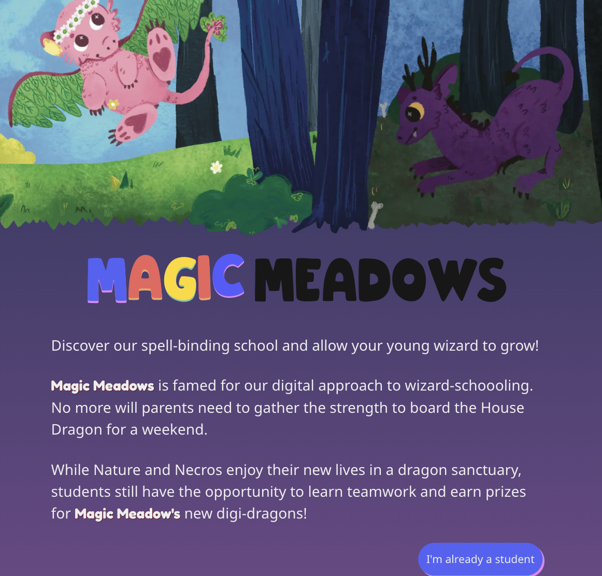

# Welcome to Magic Meadows!

Creating a safe hub for students to foster community, connections and to allow the school house identity to have real meaning even in virtual learning environments, the Magic Meadows app brings students together and gives them a chance to develop a sense of responsibility together! ✨🐉

## Aims & Planning

We approached this assignment with a shared goal as a group: to bring together everything we had attempted in past assignments and display each piece of functionality as part of a cohesive app. The decision to "stage" the app in a world of magic and dragons allowed us to have fun with otherwise benign tasks such as copywriting and asset creation, and the choice to aim the app at younger users was consciously made as it allowed us to skew more "fun" in our design.

Education was, of course, also on our minds as we came to the end of our educational bootcamp. Past experiences in education meant that we were certain to prioritise accessibility in our app (and to also provide a virtual environment where students can form relationships with one another even if circumstances prevent them from being physically in class with one another).

The target demographic for our app shaped a lot of our thoughts as we went ahead with planning the visual design and user stories. For example, only teachers should be able to delete comments, as it creates a deterrent for students who may post a nasty message and then quickly delete to claim innocence.

Giving the school a personality also aided our planning: it has two houses, each of which is associated with a certain pet and colour scheme. This was decided when designing our wireframe on Figma, and colour schemes were based on suitable palettes generated on <a href="https://coolors.co">Coolors.</a>

We looked at other apps aimed at children for a visual guide, and the work of <a href="https://www.anooshasyed.com">Anoosha Syed</a> to help replicate that "children storybook" feel that we believed matched well with the idea of a magical school.

Multiple resources were used in order to communicate effectively throughout the task, and to account for varying communication styles: Google Meet, Discord, Trello, a Google Document and even our comments in our code and pull requests.

## User Stories

We wrote user stories utilising different user personas, as each persona would have a different experience of and use for the app.

**Student:**

⭐️ I want the site to be easy to navigate and for the visuals to make sense and appeal to my intended age group

⭐️ I want the pet to be easy to interact with and fun/cute

⭐️ I want to see all my classes

⭐️ I want to be able to message other students

**Teacher:**

⭐️ I want to be able to delete messages in the message board if they contain inappropriate information or language

⭐️ I want to be able to see a list of students in each house

⭐️ I want to be able to see a list of all classes offered in the school

⭐️ I want to be able to toggle rewards onto the pet for my class

A stretch goal would see us implement yet another persona: an older student, who may want more challenging interactions with the pet and who could private message friends, not just communicate on the open house message board.

## Under the Hood (so to speak)

We designed our database schema as a group, using <a href="https://drawsql.app">Draw SQL</a> as a helpful way to visualise. Although efforts were made to account for everything needed at the beginning, it was inevitable that during the development process we would run into situations like "well, wouldn't it be easier if we changed X table to Y, or created table Z instead?" and indeed it often was easier! This meant that although we knew from the beginning what information we wanted our database to store, the schema design transformed along the way.

Following the creation of our database we designed the component tree, using both the wireframe and database to ensure that each aspect of the app would be represented in a component. Although messy (to be kind) it was effective in allowing all of us to understand the blueprints of our app, and it did not undergo very many changes.

We used both Clerk and Supabase, and the chance for individual-driven learning on Week 10 meant that we could utilise Supabase Buckets in order to store our assets, rather than rely on stock assets from elsewhere. A significant amount of SQL went into this app, and we still think that was the best approach!

## The Building

Working on the app was done with a number of approaches: regular stand-ups which often resulted in group debugging and feature planning, pair programming and solo developing on a particular component to ensure no work was ever repeated or conflicting.

Planning was done quickly and without any issue, so when it came to the building part of development it seemed (at least to me) like we were waiting on the other shoe to drop but with careful management we avoided any major problems. The decision to use hand-drawn assets obviously added some extra time to the building process that was not coding-related, but we agree that the use of these assets suited the feeling of the website and created a sense of personality for the school (and app).

We made use of plenty of resources to enhance what is, in effect, a simple database-driven app with conditional / query-based rendering. This includes (but is not limited to) further research on CSS and Framer Motion to add that little extra fun that would match our demographic.

Although we could not implement a feature we created and debugged into the final live app (animation from the pet on button press, including a timeout), we have a working local version that we could easily implement as a stretch goal (once we have more time, as it requires some movement of components and other functions).

The MVP was prioritised at all points in the project, and we aimed to address the functionality of the MVP before the styling. This allowed us to have a clear idea of what tasks remained outstanding and approaching the MVP on a component-by-component basis meant that testing and debugging could be done each step of the way.

Mobile-first styling was chosen as we felt it was much more likely a child would have access to a mobile (or small tablet) than a desktop computer. Time limitations meant that breakpoints remain a stretch goal, although I believe that the site still retains functionality on a wider screen .. it just doesn't look as good! The mobile-first styling also guided a lot of page design choices: the buttons should be at the bottom for ease of tapping, and rounded styles were used to make them more appealing to children.

## Reflections

#### Alison

I enjoyed it. Good team, great ideas. I think we all worked together well and sorted out our problems as we went along. We got a lot of what we set out to do into the code which is great, and it works. I’m happy with my contribution so far, but we haven’t done the presentation yet! 122 Commits.

If this is short and sounds a bit muted it’s because my brain is now custard.

#### Becca

I’m really happy with how this project turned out as a group - this was such a fun project to work on, and I found that the scope could just grow and grow alongside our ideas!

I think as a group we worked well - our strong suit being that we always pushed each other for clarity when finding solutions or before going ahead with our individual work, and we weren’t afraid to ask each other for help or call it in externally when identifying a blocker that was taking up too much development time. This meant that the project was focused from the get-go and the vision only got brighter each day!

Personally, I would say I am happy with how I contributed to the group as I strived to show up, stay involved and focused, but in terms of physical contribution, I was definitely the weakest member. My best work was during the ideation and planning stages - I did a lot of admin, prep and small things, but when I struggled during production, my coding skills were not up to the speed of the group and I simply contributed less overall. I am still happy with the project, had a wonderful time with the group and would continue working on stretching Magic Meadows to its full potential any day!

#### Quinn

What do you mean this is the last assignment .. (ಥ﹏ಥ)

This assignment was incredibly fun to work on from the concepting phase right through to the final styling choices, although challenging at times. When reflecting on this past week vs my experience in Week 05, I certainly involved myself a lot more with the backend, and designed a lot of the functions needed for the app to work. I felt that I was in no means the strongest coder in the group, but I feel like my organisation and communication skills allowed me to assume a pseudo team-leader role that carried with it some more responsibility in delegating tasks and facilitating communication.

The main/landing page was something I took on with the aim that it should be eye-catching and engaging, and I am very proud of the visual result (although there is no real exciting functionality to write home about). I feel like I provided support to all members of the group throughout the week, and my greatest sense of pride in this project is largely tied to our teamwork overall and the knowledge that we could rely on one another to talk through an issue while screensharing, and trust that we would help each other out the very best we could.

SELECT \* FROM last_12_weeks < a SQL joke I made about getting emotional that the bootcamp is over. What a project to end it on!

#### Val

This has to be the highlight of my bootcamp journey. Working alongside such brilliant minds kept me challenged, inspired, and constantly learning. From the ideation phase to project completion, it was a truly refreshing and rewarding experience.

I’m walking away with not just new skills and tools, but a fresh perspective on collaboration, creativity, and problem-solving.

We went beyond our MVP, and we’ve already identified exciting areas for future exploration and stretch goals. I’m definitely looking forward to more pull requests and contributions as we continue evolving the project.

## References and Resources

⭐️ <a href ="https://coolors.co/palette/220901-621708-941b0c-bc3908-f6aa1c">Coolors</a>

⭐️ <a href="https://opendyslexic.org/">OpenDyslexic</a>

⭐️ <a href="https://nextjs.org">Next Docs</a>

⭐️ <a href="https://motion.dev">Motion Docs</a>

⭐️ <a href="https://designpixie.com/products/inspire-font-pair">Inspire Font</a>

⭐️ <a href="https://icon-icons.com/icon/wizard-scary-hat-magic-witch-halloween/229396#google_vignette">Favicon</a>

⭐️ <a href="https://codepen.io/fossheim/pen/ExjdLRp">CSS 3D Text</a>

⭐️ <a href="https://www.kirupa.com/html5/sprite_sheet_animations_using_only_css.htm">Spritesheet Animation</a>

⭐️ <a href="https://tabler.io/icons">Tabler Icons</a>

🌟 Manny & Joe
